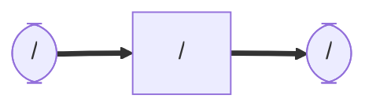

# lucia_nav2
### Node and Topic

## Dependency
    sudo apt install ros-humble-twist-mux
## Setup
    cd ~/ros2_ws/src  #Go to ros workspace

    git clone https://github.com/iHaruruki/lucia_nav2.git #clone this package

    cd ~/ros2_ws

    colcon build --symlink-install

    source install/setup.bash

## Usage
    ros2 launch nav2_bringup navigation_launch.py use_sim_time:=false

## License
## Authors
## References
