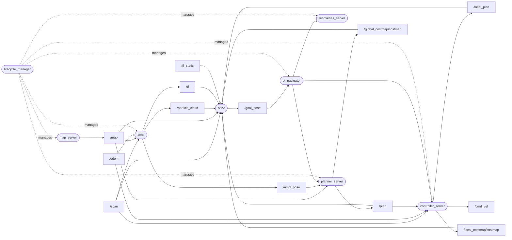

---
config:
  layout: elk
---

```mermaid
flowchart LR
    MAP_SERVER(["map_server"]) --> T_MAP["/map"]
    T_SCAN["/scan"] --> AMCL(["amcl"]) & CONTROLLER(["controller_server"]) & RVIZ(["rviz2"])
    T_MAP --> AMCL & PLANNER(["planner_server"]) & RVIZ
    T_ODOM["/odom"] --> AMCL & CONTROLLER
    AMCL --> T_PARTICLE["/particle_cloud"] & T_AMCL_POSE["/amcl_pose"] & T_TF["/tf"]
    T_AMCL_POSE --> PLANNER
    PLANNER --> T_PLAN["/plan"] & T_COSTMAP_GLOBAL["/global_costmap/costmap"]
    T_PLAN --> CONTROLLER & RVIZ
    CONTROLLER --> T_CMD_VEL["/cmd_vel"] & T_LOCAL_PLAN["/local_plan"] & T_COSTMAP_LOCAL["/local_costmap/costmap"]
    T_GOAL["/goal_pose"] --> BT_NAV(["bt_navigator"])
    BT_NAV --> PLANNER & CONTROLLER & RECOVERY(["recoveries_server"])
    LIFECYCLE(["lifecycle_manager"]) -. manages .-> MAP_SERVER & AMCL & PLANNER & CONTROLLER & BT_NAV & RECOVERY
    T_PARTICLE --> RVIZ
    T_LOCAL_PLAN --> RVIZ
    T_COSTMAP_GLOBAL --> RVIZ
    T_COSTMAP_LOCAL --> RVIZ
    T_TF --> RVIZ
    T_TF_STATIC["/tf_static"] --> RVIZ
    RVIZ --> T_GOAL
```